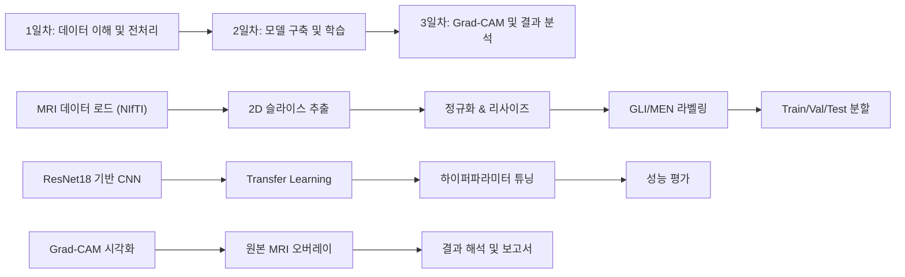

# 🧠 BraTS 뇌 MRI 이진 분류 프로젝트 기획안

---

## 1. 데이터 현황 분석

현재 보유한 데이터셋을 분석한 결과입니다.

### 데이터셋 구성

| 데이터셋 | 유형 | Training 수 | Validation 수 | 모달리티 |
|---------|------|:-----------:|:------------:|---------|
| **FeTS 2021** | Glioma (교모세포종) | ~341명 | ~111명 | T1, T1ce, T2, FLAIR + seg |
| **BraTS-GLI** | Glioma (교모세포종) | ~1,251명 | 있음 | T1c, T1n, T2f, T2w + seg |
| **BraTS-MEN** | Meningioma (수막종) | ~47명 + Train폴더 | 있음 | T1c, T1n, T2f, T2w + seg |
| **BraTS-PED** | Pediatric (소아 종양) | ~99명 | 있음 | T1c, T1n, T2f, T2w + seg |

### 각 환자 폴더 구조 (예시)
```
BraTS-MEN-00023-000/
├── BraTS-MEN-00023-000-t1c.nii.gz    # T1 조영증강 (Contrast Enhanced)
├── BraTS-MEN-00023-000-t1n.nii.gz    # T1 Native
├── BraTS-MEN-00023-000-t2f.nii.gz    # T2 FLAIR
├── BraTS-MEN-00023-000-t2w.nii.gz    # T2 Weighted
└── BraTS-MEN-00023-000-seg.nii.gz    # Segmentation Label (종양 영역 마스크)
```

> [!NOTE]
> - 모든 데이터는 **3D NIfTI (.nii / .nii.gz)** 형식의 뇌 MRI
> - 4가지 MRI 모달리티 + 1개의 Segmentation 라벨 포함
> - Segmentation 라벨에는 종양 하위 영역 (ET, TC, WT 등)이 표시됨
> - `supplementary/meningioma_clinical_data.xlsx`에 수막종 임상 데이터 존재

---

## 2. 이진 분류 프로젝트 아이디어 3가지

### ⭐ 아이디어 A: **Glioma vs Meningioma 종양 유형 이진 분류** (추천)

| 항목 | 내용 |
|------|------|
| **주제** | MRI 기반 교모세포종(Glioma) vs 수막종(Meningioma) 이진 분류 |
| **목표** | 뇌 MRI 영상으로부터 종양 유형을 자동 판별하는 CNN 모델 구축 |
| **라벨링** | BraTS-GLI → Class 0 (Glioma), BraTS-MEN → Class 1 (Meningioma) |
| **데이터 규모** | GLI ~1,251 + MEN ~47 → **클래스 불균형 존재** → 서브샘플링/오버샘플링 필요 |
| **의학적 의의** | 두 종양은 치료 방향이 완전히 다름 (GLI: 항암치료 필수, MEN: 수술적 절제 가능) |
| **Grad-CAM 적합성** | 두 종양의 형태학적 차이를 모델이 어디에서 포착하는지 시각화 가능 |

> [!TIP]
> **추천 이유**: 
> - 사진의 프로젝트 구조(CNN → 성능평가 → Grad-CAM)에 가장 정확히 부합
> - 의학적으로 의미 있는 분류 문제 (실제 임상에서도 감별 진단이 중요)
> - 불균형 데이터 처리가 추가 연구 포인트로 작용
> - Explainable AI (Grad-CAM)로 모델 판단 근거를 해석하기에 적합

**클래스 불균형 해결 전략:**
1. GLI에서 랜덤 서브샘플링 (~100개 선택)
2. MEN에 데이터 증강 (회전, 뒤집기, 밝기 조정)
3. Weighted Loss Function 적용
4. 또는 FeTS 2021 데이터를 GLI 대신 사용 (~341명으로 불균형 완화)

---

### 아이디어 B: **종양 존재 vs 비존재 슬라이스 이진 분류**

| 항목 | 내용 |
|------|------|
| **주제** | MRI 2D 슬라이스에서 종양이 있는 슬라이스 vs 없는 슬라이스 분류 |
| **목표** | 3D MRI를 2D 슬라이스로 변환 후, 종양 유무를 이진 판별 |
| **라벨링** | seg 마스크에서 종양 픽셀이 있으면 → Positive(1), 없으면 → Negative(0) |
| **데이터 규모** | 1명당 ~155개 슬라이스 × 341명 = **~52,000+ 슬라이스** (대용량) |
| **장점** | 라벨을 seg 파일에서 자동 생성 가능, 데이터 규모 대폭 확대 |
| **Grad-CAM 적합성** | 종양 위치를 정확히 시각화 가능 (seg 마스크와 직접 비교 검증) |

> [!IMPORTANT]
> 이 접근은 데이터가 많아 학습이 안정적이지만, **의학적 난이도는 낮은 편** (종양이 있는 슬라이스와 없는 슬라이스 구분은 상대적으로 쉬운 태스크)

---

### 아이디어 C: **High-Grade vs Low-Grade Glioma 등급 분류**

| 항목 | 내용 |
|------|------|
| **주제** | 교모세포종의 악성 등급 이진 분류 (HGG vs LGG) |
| **목표** | Segmentation 마스크의 종양 하위 영역 패턴으로 등급 추정 |
| **라벨링** | seg에서 enhancing tumor(ET) 영역 유무/크기로 proxy label 생성 |
| **의학적 의의** | WHO 등급에 따라 예후와 치료 전략이 크게 달라짐 |
| **도전 과제** | 명시적 등급 라벨이 없어 seg 마스크에서 간접 라벨링 필요 |

> [!WARNING]
> FeTS/BraTS 데이터셋에 **명시적인 Grade 라벨이 제공되지 않음**. Enhancing Tumor 크기 기반 proxy label을 만들어야 하므로 라벨 신뢰도에 한계가 있습니다.

---

## 3. 최종 추천: 아이디어 A (Glioma vs Meningioma)

### 사진과의 매칭도



### 3주 일정 (사진 기준)

| 주차 | 내용 | 산출물 |
|:---:|------|--------|
| **1주차** | 데이터 이해 및 전처리 | 전처리된 2D 슬라이스, EDA 보고서, Train/Val/Test 분할 완료 |
| **2주차** | CNN 모델 구축 & 학습 | ResNet18 모델, Confusion Matrix, ROC Curve (AUC > 0.87 목표) |
| **3주차** | Grad-CAM & 결과 분석 | Grad-CAM 히트맵, 최종 보고서 및 발표 자료 |

### 주요 성능 지표
- **Accuracy, Precision, Recall, F1-score**
- **Confusion Matrix**
- **ROC Curve & AUC** (목표: > 0.87)

### 사용 도구
- Python, PyTorch/TensorFlow
- OpenCV, NumPy
- Matplotlib, Seaborn
- Grad-CAM 라이브러리 (`pytorch-grad-cam`)
- NiBabel (NIfTI 파일 처리)
- Google Colab (GPU 활용)

---

## 4. 결정이 필요한 사항

1. **어떤 아이디어**를 선택하시겠어요? (A/B/C)
2. **프레임워크 선호**: PyTorch vs TensorFlow?
3. **실행 환경**: 로컬 GPU vs Google Colab?
4. **사용할 데이터셋**: BraTS-GLI 전체 사용 vs FeTS 2021만 사용?
5. 선택 후 바로 **1일차 코드 작성**을 시작할까요?
